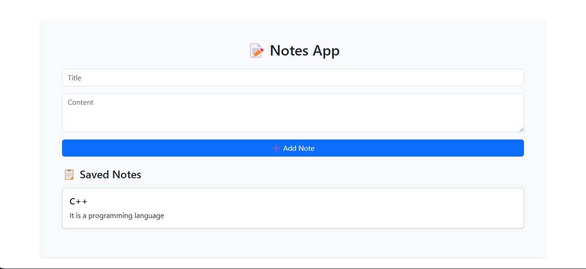

# 📝 Simple Notes App (MERN Stack)

A minimal full-stack **Notes App** built with the **MERN stack (MongoDB, Express, React, Node.js)**. This project demonstrates how to build a basic notes management system with RESTful API integration, form handling, and responsive UI using React functional components and hooks.

---

## 📌 Features

- ➕ Add new notes (title & content)
- 📋 Display all notes on page load
- ⚡ REST API with Express.js
- 🗃️ MongoDB with Mongoose modeling
- 🔄 Axios-based HTTP requests
- 🎨 Basic styling (Bootstrap)
- 💡 Built with React functional components using `useState` and `useEffect`

---

## ⚙️ Tech Stack

- **Frontend**: React.js, Axios, Bootstrap
- **Backend**: Node.js, Express.js
- **Database**: MongoDB + Mongoose

---

## 📁 Structure & Working

### Backend (Node.js + Express + MongoDB):

- `POST /api/notes` – Add a new note
- `GET /api/notes` – Retrieve all notes

Each note has:
- `title`: *String* (required)
- `content`: *String* (required)

Mongoose is used for schema modeling.

### Frontend (React.js):

- A form with two fields:
  - Title
  - Content

- On form submit:
  - Save the note via POST request
  - Display saved note in a list below

- On page load:
  - Fetch all saved notes from the API and display them

---

## 🛠️ Installation

### 1. Clone the repository
```bash
git clone https://github.com/Rishmo/Notes_App.git
cd Notes_App
````

### 2. Setup Backend

```bash
cd backend
npm install
```

Create a `.env` file:

```env
PORT=5000
MONGO_URI=your_mongodb_connection_string
```

Start backend server:

```bash
npx nodemon server.js
```

### 3. Setup Frontend

```bash
cd frontend
npm install
npm start
```

---

## 📸 Screenshot

> 

---

## 🔗 API Endpoints

| Method | Endpoint     | Description         |
| ------ | ------------ | ------------------- |
| POST   | `/api/notes` | Add a new note      |
| GET    | `/api/notes` | Get all saved notes |

---

## 🙌 Contribution

Contributions are welcome!

* Fork the repo
* Create your feature branch
* Commit and push your changes
* Open a pull request

---

## 📬 Contact

Connect with me:
🔗 [GitHub Profile](https://github.com/Rishmo)

